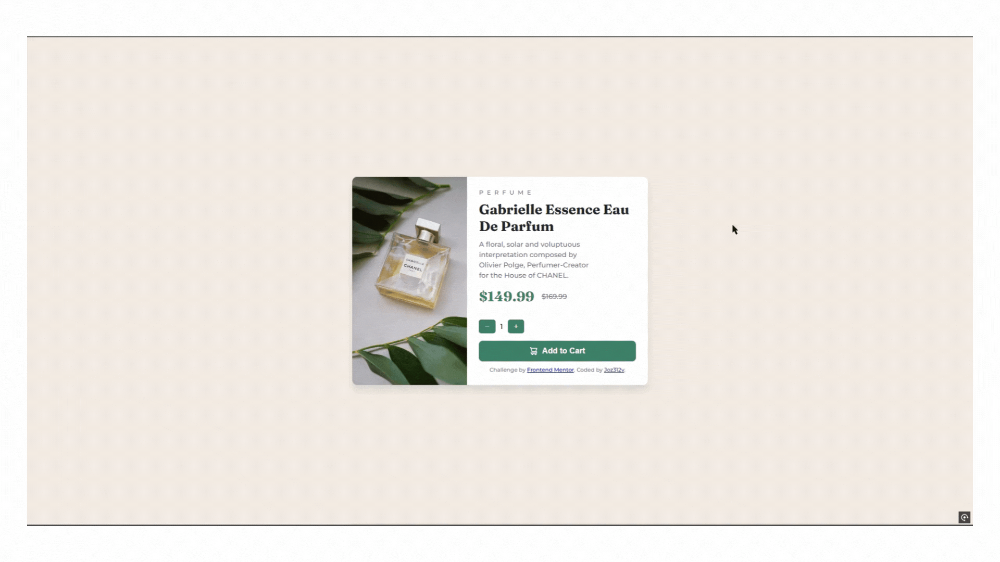

# Frontend Mentor - Product preview card component solution

This is a solution to the [Product preview card component challenge on Frontend Mentor](https://www.frontendmentor.io/challenges/product-preview-card-component-GO7UmttRfa). Frontend Mentor challenges help you improve your coding skills by building realistic projects. 

## Table of contents

- [Overview](#overview)
  - [The challenge](#the-challenge)
  - [Screenshot](#screenshot)
  - [Links](#links)
- [My process](#my-process)
  - [Built with](#built-with)
  - [What I learned](#what-i-learned)
  - [Continued development](#continued-development)
  - [Useful resources](#useful-resources)
- [Author](#author)
- [Acknowledgments](#acknowledgments)


## Overview

### The challenge

Users should be able to:

### The Challenge

Users should be able to:

- View the optimal layout depending on their device's screen size (mobile & desktop responsive).
- See hover and focus states for interactive elements such as buttons.
- Adjust the product quantity dynamically with a working cart system.


### Screenshot



### Links

- Solution URL: [GitHub](https://github.com/Joz312v/secure-frontend-product-Preview)
- Live Site URL: [Live Preview](https://frontend-product-preview-challenge.netlify.app/)

## My process

### Built with

### Tech Stack:
- **Frontend:** HTML, CSS, JavaScript
- **Backend:** Node.js, Express.js
- **API Proxy:** Express-based API proxy for security
- **Deployment:** Railway (backend & API proxy), GitHub (frontend code)
### Features Implemented:
✅ Fully responsive design for desktop & mobile  
✅ Secure API setup with a proxy server to hide backend URLs  
✅ Dynamic cart functionality (adjust product quantity)  
✅ API-driven data fetching to update pricing  
✅ Smooth UI interactions with hover/focus effects  

### What I learned

This project helped me improve my frontend and backend development skills, especially in the areas of JavaScript, API security, and deployment.

```js
// Fetch the backend URL dynamically from the API Proxy
fetch("/api/get-urls")
  .then((response) => response.json())
  .then((data) => {
    const proxyAPI = data.proxyAPI; // Get hidden backend URL

    // Use the proxy API to fetch secret data securely
    fetch(`${proxyAPI}/api/get-secret`)
      .then((response) => response.json())
      .then((data) => {
        document.querySelector(".price").textContent = `$${data.totalPrice}`;
        document.querySelector(".quantity").textContent = data.quantity;
      })
      .catch((error) => console.error("Error fetching data:", error));
  });

```
### Setting Up a Backend with CORS
Initially, I faced issues where the frontend couldn’t communicate with the backend due to CORS policy errors. I learned how to configure CORS correctly for multiple origins.

```js
app.use(cors({
  origin: ["link here"],
  methods: ["GET", "POST"],
  allowedHeaders: ["Content-Type"],
  credentials: true
}));

```
- **API security:** Using a proxy to hide backend URLs.
- **CORS fixes:** Allowing cross-origin requests correctly.
- **Dynamic data updates:** Keeping product quantity in the backend instead of localStorage.
- **Hosting frontend via Express:** Serving everything from one domain.
- **Executing hidden JavaScript:** Keeping sensitive JS logic protected.

### Continued development

While working on this project, I realized there are several areas I would like to continue improving and refining in future projects:

- 🔐 Enhancing API Security – Although I implemented an API proxy to hide backend URLs, I want to explore JWT authentication or API keys for better security in future applications.
- 💾 Storing User-Specific Data – Currently, the quantity updates are stored per session. I want to integrate a database (MongoDB or PostgreSQL) to allow users to persist their cart state across sessions.
- ⚡ Improving Performance & Caching – I plan to optimize API requests and responses using server-side caching (Redis) to improve speed and reduce unnecessary backend calls.
- 📱 Progressive Web App (PWA) – I want to make future projects installable as PWAs for a better mobile experience with offline functionality.
- 🎨 Advanced Animations – While I added hover states, I want to learn and apply GSAP or Framer Motion for smoother, high-quality animations in UI interactions.

### Useful resources

- [MDN Web Docs - CORS](https://developer.mozilla.org/en-US/docs/Web/HTTP/CORS) – This guide helped me properly configure CORS policies when setting up the API proxy.
- [Express.js Documentation](https://expressjs.com/en/resources/middleware.html) – I used this to learn how to      serve static files, set up API routes, and implement  middleware for JSON parsing and CORS handling.
- [JavaScript Fetch API](https://developer.mozilla.org/en-US/docs/Web/API/Fetch_API) – Helped refine my understanding of handling API requests and responses in JavaScript.
- [Node.js Best Practices](https://github.com/goldbergyoni/nodebestpractices) – A great resource that helped me structure my backend properly and improve code security.

## Author

- Frontend Mentor - [@Joz312v](https://www.frontendmentor.io/profile/Joz312v)
- GitHub - [@Joz312v](https://github.com/Joz312v)

## Acknowledgments

This project was inspired by [Frontend Mentor](https://www.frontendmentor.io/), which provided the challenge.  

- [MDN Web Docs](https://developer.mozilla.org/en-US/)
- [CSS Tricks](https://css-tricks.com/)
- [Express.js Documentation](https://expressjs.com/)
- [NPM Modules: cookie-parser, cors, dotenv, express](https://www.npmjs.com/)
